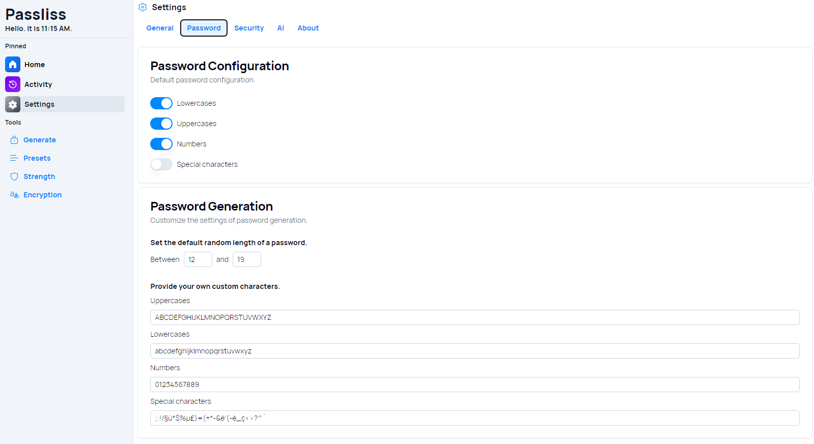
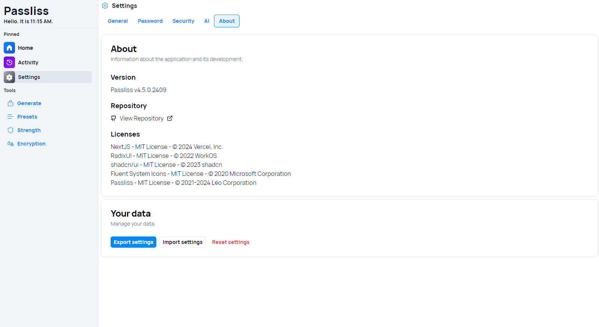

A new version of Passliss is now available, and it is the version 4.5.0.2409. We are proud to introduce the newly-redesigned settings page, making it easier to customize your experience with the app.

## The Redesigned Settings Page: An Overview

One of the standout features of Passliss 4.5.0.2409 is the revamped settings page. The new design is intuitive, offering a clean, modern interface that makes configuring the application easier than ever. Let’s explore the new settings options and how they can improve your experience with Passliss.

### New layout

The settings page now has Tab layout, making it easier to switch between settings. You no longer need to expand a section to get all available settings, making it quicker to make changes in your configuration. This new user interface is also more intuitive for new users, improving the overall user experience. Now new settings were introduced; it is a UI update.

### New About Section: Transparency and Control

The updated settings page also includes a new "About" section, providing users with crucial information and tools for managing their data:

- **Licenses:** Review the licenses for the various components and libraries used within Passliss, ensuring full transparency.
- **Data Management:** Access options to import and export your data, offering flexibility in how you manage and back up your settings and preferences.

## Changelog

### New

- Added the possibility to view Key in Encryption page (#1229)
- Added locales for new Settings (#1230)
- Added General Settings (#1231)
- Added missing theme locales (#1231)
- Added Password Generation Settings (#1232)
- Added Security Settings (#1233)
- Added API Settings (#1234)
- Added About Section (#1230)
- Made the settings page responsive (#1230)

### Updated

- Made the Theme Items darker (#1231)
- Updated Licenses
- _Updated dependencies_

## Launch

[Click here](https://passliss.leocorporation.dev/) to launch Passliss in your web browser.

## Learn more

[Click here](https://leocorporation.dev/store/passliss) to learn more about Passliss
