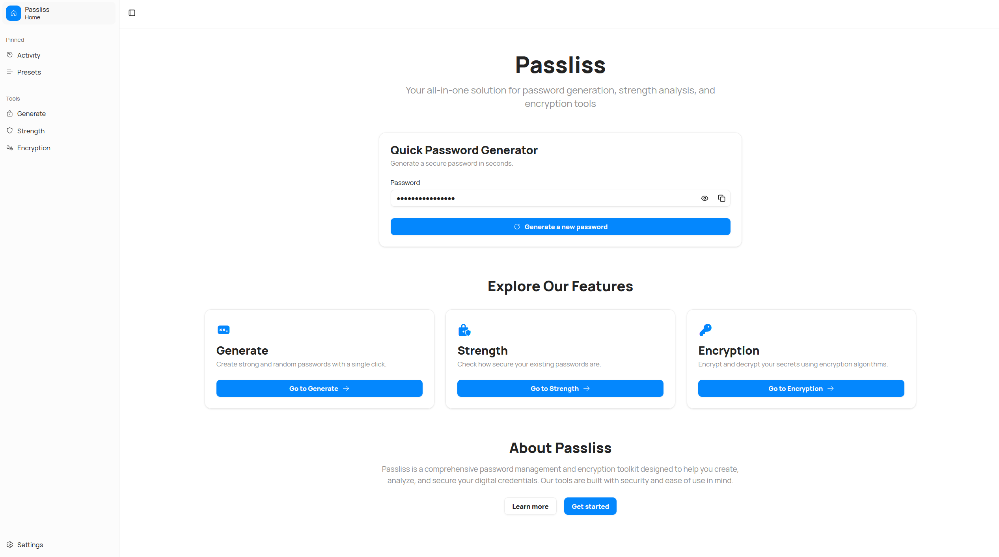

We're thrilled to announce the release of Passliss version 5.1.0.2507, which brings a host of new features and improvements to enhance your experience.

## New Sidebar Design

The most notable change in this release is the complete redesign of the sidebar. The new sidebar is not only more visually appealing but also significantly improves navigation throughout the app. It features a cleaner layout, better organization of tools, and enhanced accessibility options, making it easier for you to find what you need quickly.

## Other Improvements

In addition to the new sidebar, this version includes several other enhancements, such as a new mobile UI system and a revamped settings hook system. These changes aim to streamline your workflow and provide a more cohesive user experience across different devices.

## Changelog
### New

- Added Sidebar component (#1976)
- Added new sidebar (#1976)
- Added new mobile UI system (#1978)
- Added new hook system for Settings (#1978)
- Added new Settings hook (#1978)
- Added new Preset hook (#1978)

### Fixed

- Fixed responsive issue in Settings
- Fixed an issue with new hooks

### Updated

- _Updated dependencies_

## Launch

[Click here](https://passliss.leocorporation.dev/) to launch Passliss in your web browser.

## Learn more

[Click here](https://leocorporation.dev/store/passliss) to learn more about Passliss
