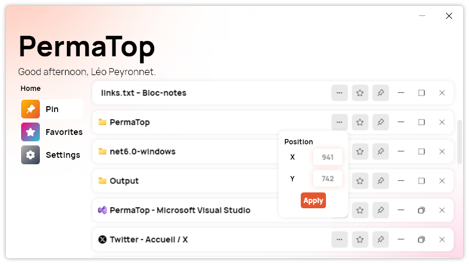

A new version of PermaTop is available, and it brings several new features and improvements to the app.

## Control your windows

You can now maximize, minimize, restore, and close windows directly from PermaTop. Plus, you can now also set manually the position of a window. Finally, we added the icon of the window next to its name.

## Changelog

### New

- Added the possibility to get the state of a window (#5)
- Added the possibility close a window (#6)
- Added the possibility to maximize a window (#7)
- Added the possibility to restore a window (#8)
- Added the possibility to minimize a window (#9)
- Added the possibility to display the window icon (#10)
- Added translations (#11)
- Added the possibility to set the position of a window (#11)

### Fixed

- Fixed shadow not appearing
- Fixed an issue with maximize icon

### Updated

- Updated PeyrSharp.Env (#3)
- Updated PeyrSharp.Core (#4)

## How to get PermaTop 1.1.0.2308?

[Click here](https://tinyurl.com/PermaTop) to download PermaTop

If you are already using PermaTop, you should receive an automatic update notification when you launch the application. You can also check for updates manually by going to the settings and clicking on "Check for updates". If you are new to PermaTop, you can [download](https://tinyurl.com/PermaTop) it for free from our [website](https://leocorporation.dev/store) or our [GitHub](https://github.com/Leo-Corporation/PermaTop) page.

We hope you enjoy using PermaTop 1.1.0.2308 and find it useful for your daily tasks and productivity. As always, we welcome your feedback and suggestions on how to make PermaTop better for you. Please feel free to contact us via email, [X (Twitter)](https://twitter.com/LeoCorpNews), or GitHub.
