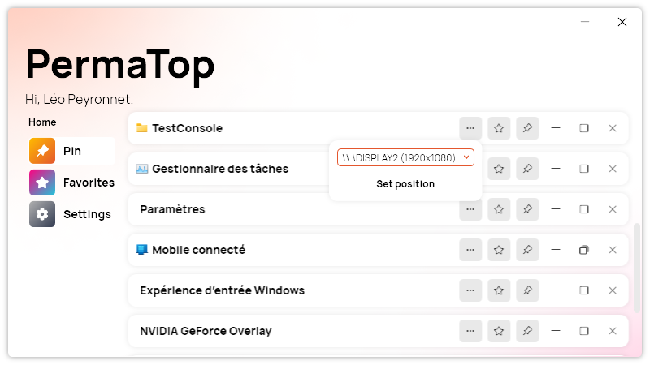

A new version of PermaTop is now available and simplifies window management if you have multiple screens.

## Improved mutliple screens experience

One of the most exciting features that we have introduced in the latest version of PermaTop is the new window control feature. This feature allows users who have multiple screens to easily move and center their window on the screen they selected. No more dragging and resizing your window manually to fit your screen!

To use this feature, simply click on the three dots icon on a window element and select "Move to screen". You will see a list of all the screens that are connected to your computer. Choose the one you want and click "Move". Your window will automatically move and center on that screen.

You can also see the current size of your window in pixels when you hover over any window element inside the app. This is useful if you want to adjust the size of your window precisely or if you want to compare the size of different windows. You can see the window size in the tooltip that appears when you hover over the element.

## Changelog

### New

- Added translations (#19)
- Added "More" menu (#20)
- Added a popup to select the screen where to move the window (#21)
- When moving a window, it stays centered (#21)
- Added window size in tooltip (#22)

### Updated

- Updated PeyrSharp.Core (#17)
- Updated PeyrSharp.Env (#18)

## Download

[Click here](https://tinyurl.com/PermaTop) to download PermaTop.
