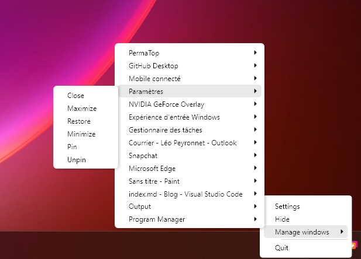

A new version of PermaTop is now available and brings a new system tray menu.

## New System tray menu

The new system tray menu is a new way to use PermaTop: You can now control opened windows with ease without having to open the PermaTop window. By adding this icon to your system tray, you will be able to maximize, minimize, close and pin any window that is opened on your PC. We also added several other options, such as the possibility to hide the PermaTop window, or the possibility to close the app directly from the menu.

## Changelog

### New

- Added assets (#29)
- Added context menu styles (#29)
- Added translations (#29)
- Added taskbar icon (#29)
- Added taskbar icon actions (#29)
- Added the possibility to control windows from taskbar icon (#30)

### Fixed

- Fixed export settings button is not readable (#28)
- Fixed menu style (#30)

### Updated

- Updated PeyrSharp.Core (#26)
- Updated PeyrSharp.Env (#27)
- Moved methods to Global class (#30)

## Download

[Click here](https://tinyurl.com/PermaTop) to download PermaTop.
