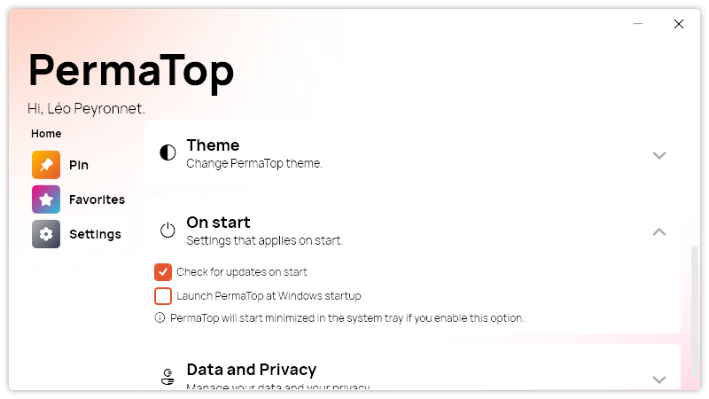

Version 1.4.0.2401 of PermaTop introduces the ability to automatically start the app on startup.

## Launch at Windows startup option

With the new launch at windows startup option, you can now enjoy the convenience of PermaTop without having to manually start it every time you turn on your computer. The app is started minimized in the system tray, so it won't interfere with your desktop or taskbar. To use PermaTop, simply right-click on the system tray icon and select "Pin" from the context menu.

## Changelog

### New

- Added translations (#39)
- Added the possibility to launch the app on start (#39)
- PermaTop starts minimized on start (#39)
- Added information message (#39)

### Fixed

- Fixed popup menu not visible in dark mode (#37)
- Fixed Apply button in "Move to screen" not visible (#38)
- Fixed a margin issue

### Updated

- Updated PeyrSharp.Env (#34)
- Updated PeyrSharp.Core (#35)
- Made Apply button more consistent
- Updated copyright years (#40)
- Updated dependencies

## Download

[Click here](https://tinyurl.com/PermaTop) to download PermaTop.
