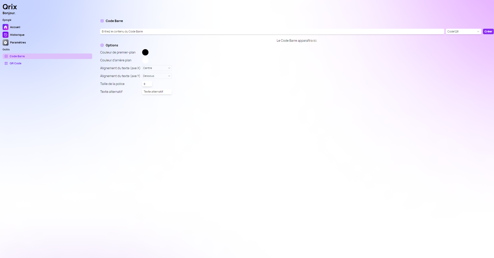

A new version of Qrix is available, and it brings new customization options when generating a bar code.

## New Bar Code Options

With the latest update, Qrix offers more customization options for users who want to add text to their codes. Users can now set the text x axis alignment, the y axis alignment, the font size and the alternative text to display on the bar code. These features allow users to create more personalized and accessible codes that suit their needs and preferences.

## Changelog

### New

- Added grid layout in Options section (#42)
- Added locales (#42)
- Added the possibility to set the text x alignment (#42)
- Added the possibility to set the text y alignment (#43)
- Added the possibility to set the font size (#44)
- Added the possibility to set the alt text (#45)
- Added the possibility to set default values for options (#46)

### Fixed

- Fixed key issue in locales

### Updated

- Refactored code (#42)
- Updated dependencies

## Launch Qrix

[Click here](ttps://qrix.leocorporation.dev) to launch Qrix in your browser.
