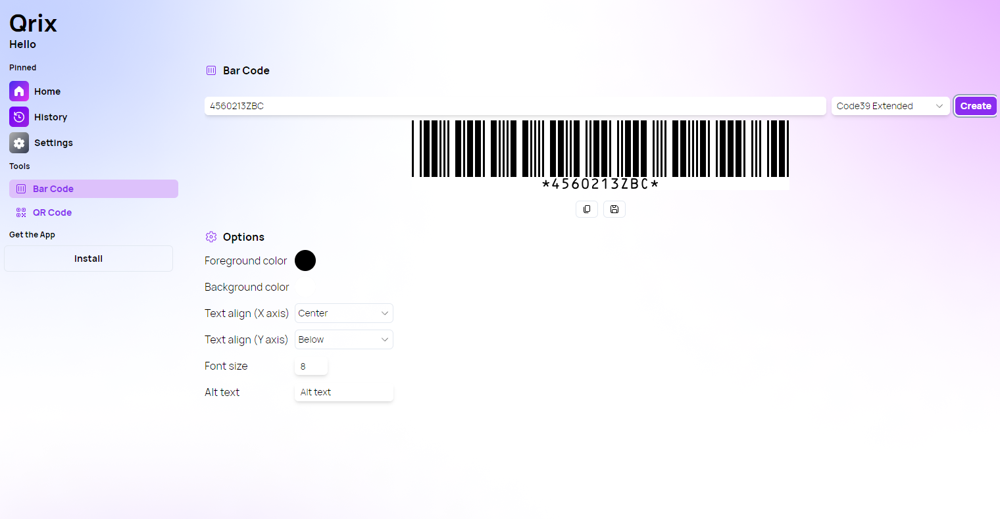
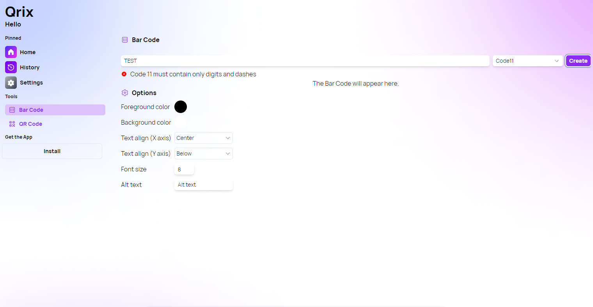

A new version of Qrix is available, and it brings new bar code types and small improvements.

## New Bar Code types

One of the main highlights of this update is the addition of several new bar code types, such as UPC-E, ISSN, ISMN, Code93 Extended, Code39 Extended, Code25 and Code16K. These bar codes are widely used in various industries and applications, such as retail, publishing, inventory and logistics. You can now generate these bar codes with Qrix and customize their appearance and settings.

## Other improvements

Another new feature is the error section in the bar code page. This section will show you any errors or warnings that may occur when generating a bar code, such as invalid input, unsupported characters or out-of-range values. This will help you troubleshoot and fix any issues with your bar code.

We have also improved the Settings UI on mobile devices, making it easier and more intuitive to adjust your preferences and options. You can now access the Settings menu from the bottom navigation bar and swipe through the different tabs.

## Changelog

### New

- Added UPC-E (#89)
- Added ISSN (#89)
- Added ISMN (#89)
- Added Code93 Extended (#89)
- Added Code39 Extended (#89)
- Added Code25 (#89)
- Added Code16K (#89)
- Added error section in bar code page (#90)

### Updated

- Improved Settings UI on mobile devices (#88)
- _Updated dependencies_

## Launch Qrix

[Click here](ttps://qrix.leocorporation.dev) to launch Qrix in your browser.
