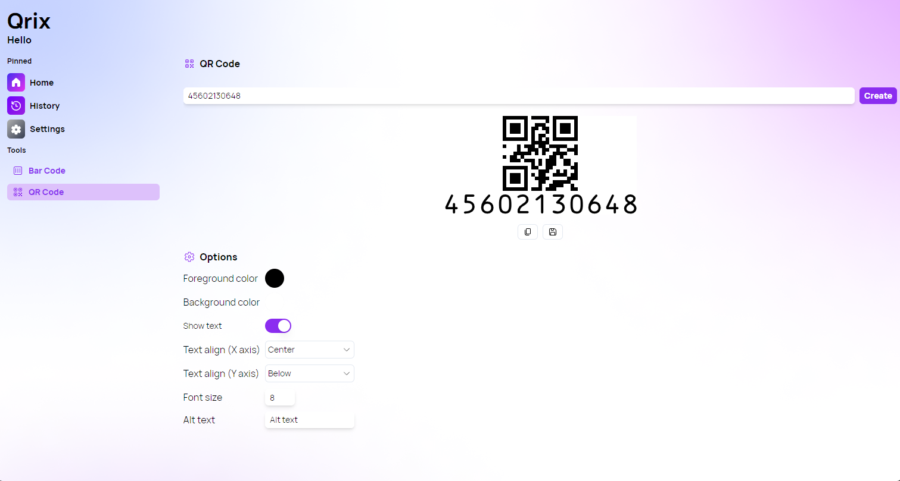

A new version of Qrix is now available, and this version brings some new features when generating QR Codes.

## New text options for QR Codes

One of the most exciting features of the latest version of Qrix is the ability to customize the text options for QR code generation. You can now adjust the text alignment (x and y axis), font size, alternative text, and toggle on and off text on the generated QR code. These options give you more control over how your QR code looks and functions. For example, you can use alternative text to provide a description of the QR code content, or you can change the font size to make the text more readable. You can also set default values for these options in the settings, so you don't have to change them every time you generate a new QR code. Qrix makes it easy and fun to create QR codes with text that suit your needs and preferences.

## Changelog

### New

- Added switch component (#163)
- Added label component (#163)
- Added locales (#163)
- Added the possibility to display text in QR Code page (#163)
- Added the possibility to customize the text for QR Code (#164)
- Added the possibility to set default values for text (#165)
- Added the possibility to show text by default (#165)

### Fixed

- Fixed classname errors
- Fixed vulnerability

### Updated

- _Updated dependencies_

## Launch Qrix

[Click here](ttps://qrix.leocorporation.dev) to launch Qrix in your browser.
