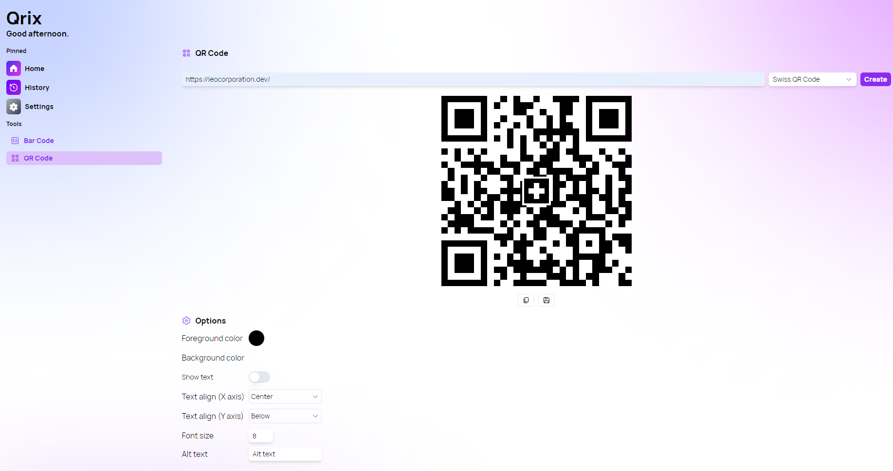

A new version of Qrix is now available, and this version brings a new QR Code type.

## New Swiss QR Code type

Introducing the Swiss QR code: a new type of QR code that is compatible with the Swiss payment system. You can use it to generate invoices, receipts, and other payment-related documents with ease. Just enter the required information and Qrix will create a Swiss QR code for you.
You can also now choose your preferred QR code type in the settings menu. Whether you want to use the standard QR code or the Swiss QR code, you can set it as your default option and Qrix will remember it for you. This way, you don't have to switch between different types every time you want to generate a QR code.

## Changelog

### New

- Added Swiss QR Code in QR Code page (#196)
- Added the possibility to set default QR Code type (#197)

### Fixed

- Fixed an issue in history
- Fixed null type issue (#197)
- Fixed a bug with settings

### Updated

- _Updated dependencies_

## Launch Qrix

[Click here](ttps://qrix.leocorporation.dev) to launch Qrix in your browser.
