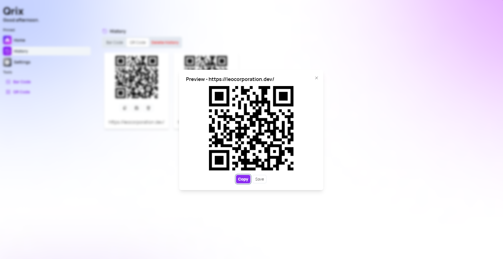

With this new version of Qrix, we made several improvements to the app's design, fixing many UI inconsistencies. Furthermore, we also added a new preview dialog in History.

## Preview dialog

When clicking on a QR Code or on a Bar Code, you will notice a new preview window dialog appearing, allowing you to see more clearly your generate code, especially on mobile devices. This feature should make it easier to scan generated QR Codes directly on a mobile device.

## Changelog

### New

- Added new color values
- Redesigned home page cards (#244)
- Improved nav bar buttons when selected (#245)
- Added new locales
- Added a new preview dialog in History (#246)
- Added drawer component (#246)
- Added preview drawer in History (#246)

### Updated

- Updated copyright years (#247)
- _Updated dependencies_

## Launch Qrix

[Click here](ttps://qrix.leocorporation.dev) to launch Qrix in your browser.
