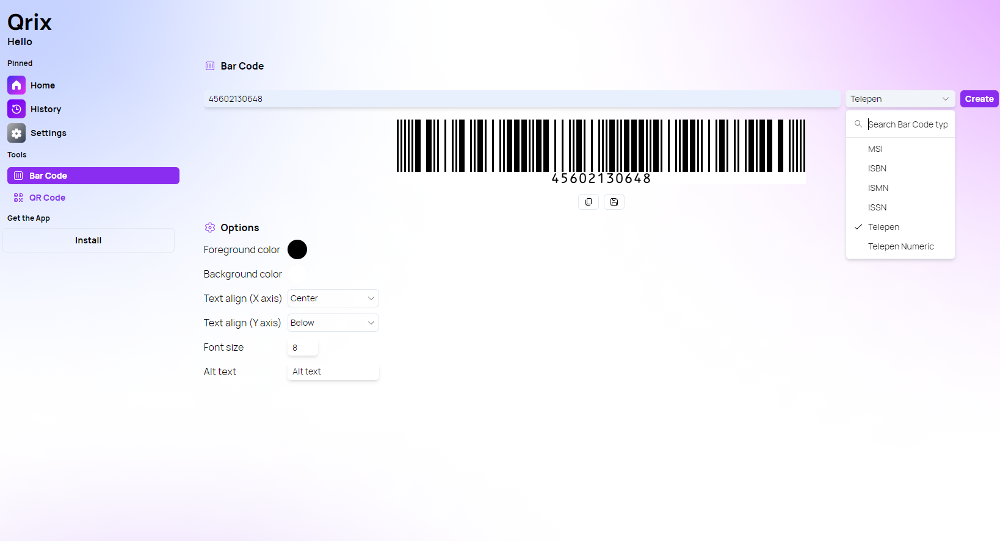

A new version of Qrix is now available, and it is the version 1.6.0.2402. This version introduces two bar code types: Telepen and Telepen Numeric. In addition, we also made several fixes and other improvements to the app.

## Telepen Bar Code

We have added support for the Telepen and the Telepen Numeric bar code types in Qrix. You will find the option in the bar code type dropdown menu in the "Bar Code" page. You can also set these two types as your default bar code type in the settings of the app.

## Changelog

### New

- Improved the UI of the Tabs component (#290)
- Added new Tab design (#290)
- Added barcode type label in History (#291)
- Added Telepen and Telepen Numeric Barcodes (#292)

### Fixed

- Fixed hover style issues on Side Bar (#288)
- Fixed hover issue on home page (#289)
- Fixed wrong font weight in settings
- Fixed alignment issue in Bar Code page

### Updated

- _Updated dependencies_

## Launch Qrix

[Click here](ttps://qrix.leocorporation.dev) to launch Qrix in your browser.

## Learn more

[Click here](https://leocorporation.dev/store/qrix) to learn more about Qrix.
