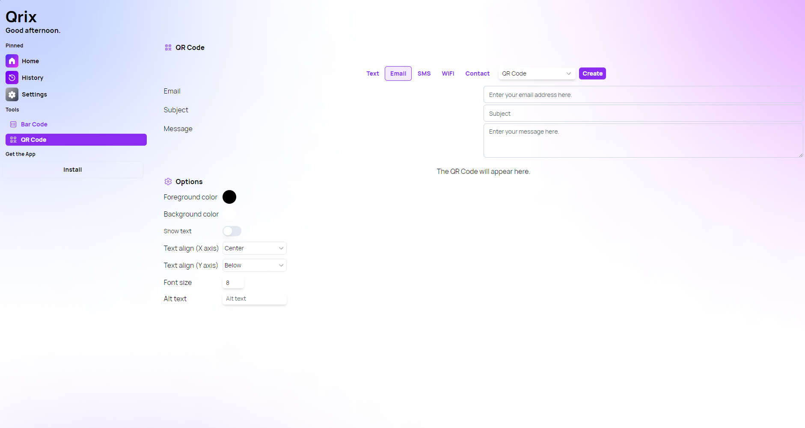
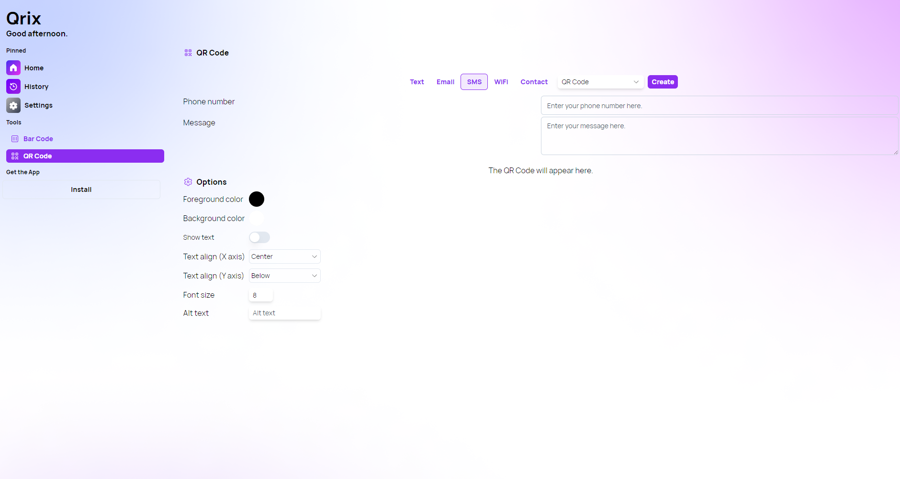
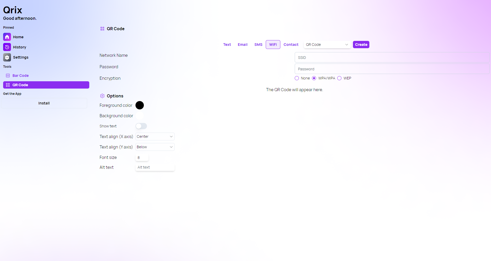
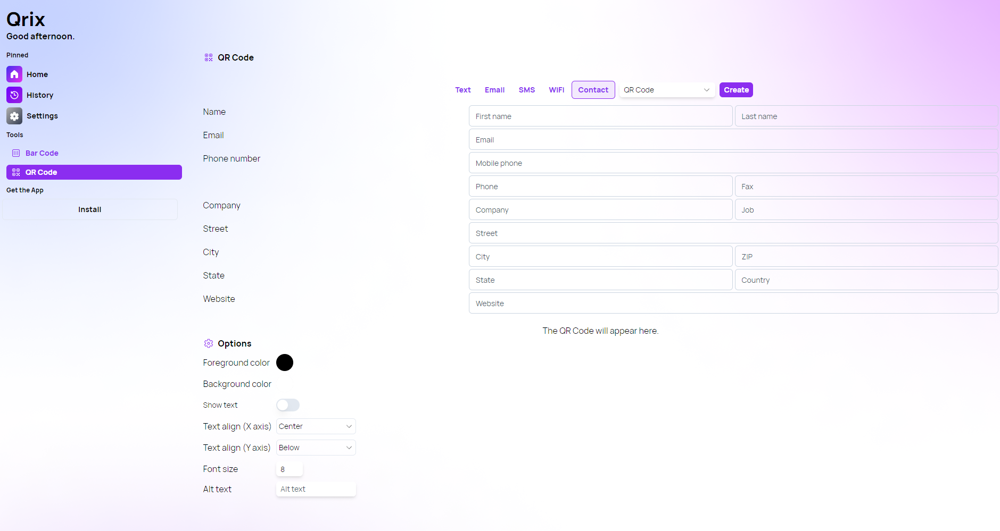

A new version of Qrix is now available, and it is the version 1.7.0.2404. With this version, we are introducing "Interactive QR Codes", a new way to share content using QR Codes. These innovative codes redefine how you share content, offering seamless connectivity and convenience like never before.

## Experience Interactive QR Codes

Interactive QR Codes revolutionize the traditional static QR Code experience by triggering dynamic actions upon scanning. Let's delve into the exciting capabilities of this new feature:

### Effortless Email Integration

With Qrix's Email QR Code generator, sending emails becomes effortless. Simply input the recipient's email address, the subject, and the message content. Upon scanning, your default email application opens instantly with the predefined settings, allowing you to send the email with just a click.

### Instant SMS Communication

The SMS QR Code generator operates similarly to its email counterpart. Input the recipient's phone number and the message content, and upon scanning, your default messaging app opens, ready to send the message promptly.

### Seamless WiFi Sharing

Sharing WiFi credentials has never been easier with Qrix's WiFi QR Code generator. Generate a QR Code containing the network name (SSID), password, and encryption protocol. Upon scanning, devices can automatically connect to the WiFi network, streamlining the sharing process.

### Effortless Contact Sharing

With the Contact QR Code generator, sharing contact information is a breeze. Qrix allows you to input comprehensive contact details, including names, phone numbers, email addresses, and postal addresses. Upon scanning, users are prompted to import the information directly into their default contact application, ensuring effortless contact management.

## Changelog

### New

- Added locales (#370)
- Added TextArea component (#370)
- Added the possibility to generate Email QR Codes (#370)
- Added the possibility to generate SMS QR Codes (#371)
- Added RadioGroup component (#372)
- Added the possibility to generate WiFi QR Codes (#372)
- Added the possibility to generate Contact Card QR Code (#373)

### Fixed

- Fixed an issue with Comboboxes
- Fixed placeholder theme (#370)

### Updated

- Optimized UI for mobile devices
- _Updated dependencies_

## Launch Qrix

[Click here](ttps://qrix.leocorporation.dev) to launch Qrix in your browser.

## Learn more

[Click here](https://leocorporation.dev/store/qrix) to learn more about Qrix.
