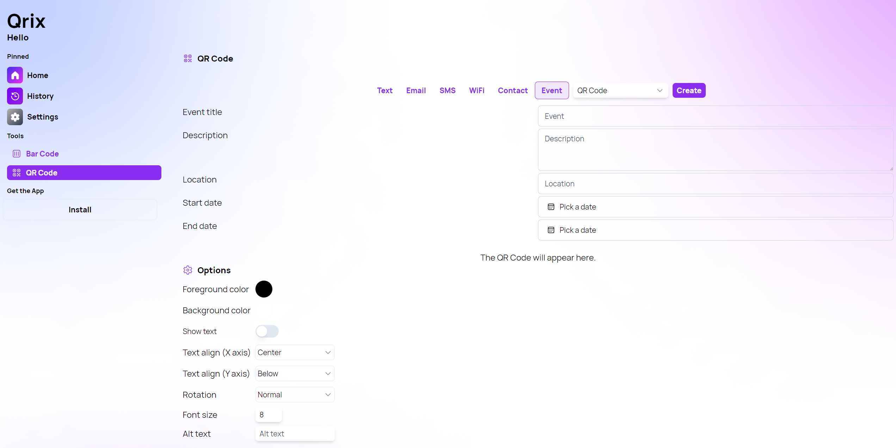
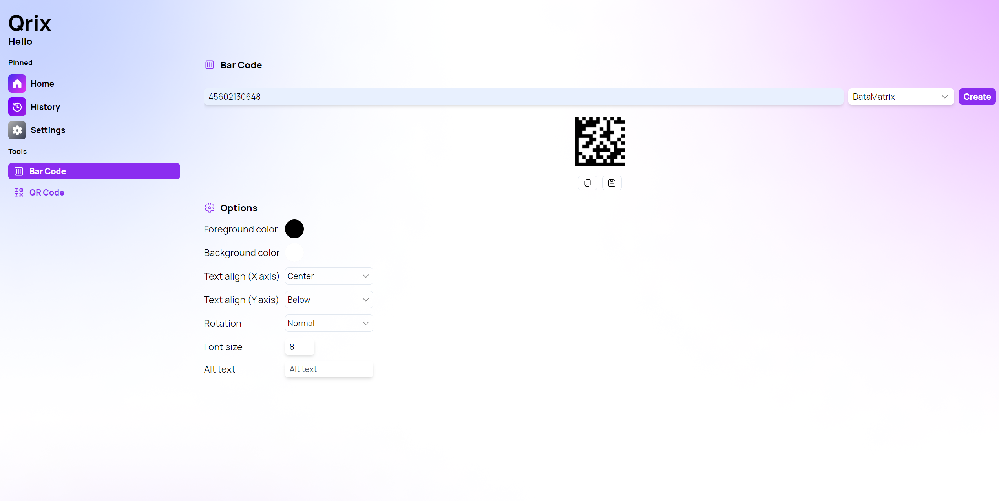

A new version of Qrix is now available, and it is the version 1.8.0.2405. We added a new bar code type and a new "Calendar Event" interactive QR Code.

## New Event QR Code

With this version of Qrix, we are introducing the Event QR Code. Utilizing the VEVENT format, this enhancement allows users to seamlessly add events to their phone calendars by simply scanning a QR code. With Qrix's Event QR Code, you can pre-create an event complete with a title, location, start and end dates, and a brief description. Once scanned, the QR code redirects users directly to their phone's calendar app, automatically populating all the event details. This innovative feature streamlines event management, making it easier than ever to ensure your attendees never miss an important date.

## New DataMatrix Bar code and options

Qrix has expanded its capabilities with the addition of the DataMatrix barcode, offering users enhanced flexibility and precision in their barcode generation needs. The DataMatrix barcode, known for its compact size and high data capacity, can now be set as the default barcode within the Qrix platform, catering to a wide range of applications from inventory management to product labeling. Additionally, Qrix introduces a new feature that allows users to rotate any QR Code or barcode, providing greater customization and adaptability for various display requirements.

## Changelog

### New

- Added DataMatrix bar code (#398)
- Added new styles to Select menus
- Added Rotation option in Bar Code page (#399)
- Added Rotation option in QR Code page (#399)
- Added the possibility to set a default rotation (#399)
- Added DatePicker component (#400)
- Added locales (#400)
- Added new Event QR Code type (#400)

### Fixed

- Fixed type issue

### Updated

- _Updated dependencies_

## Launch Qrix

[Click here](ttps://qrix.leocorporation.dev) to launch Qrix in your browser.

## Learn more

[Click here](https://leocorporation.dev/store/qrix) to learn more about Qrix.
