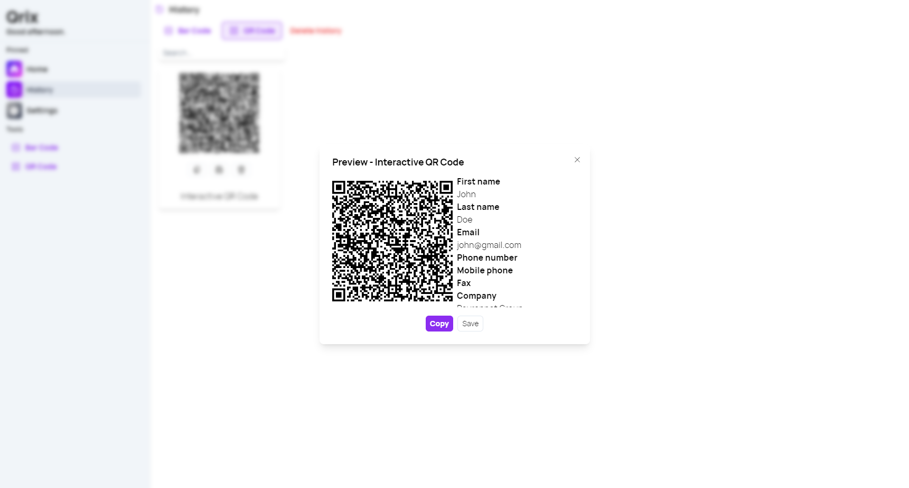
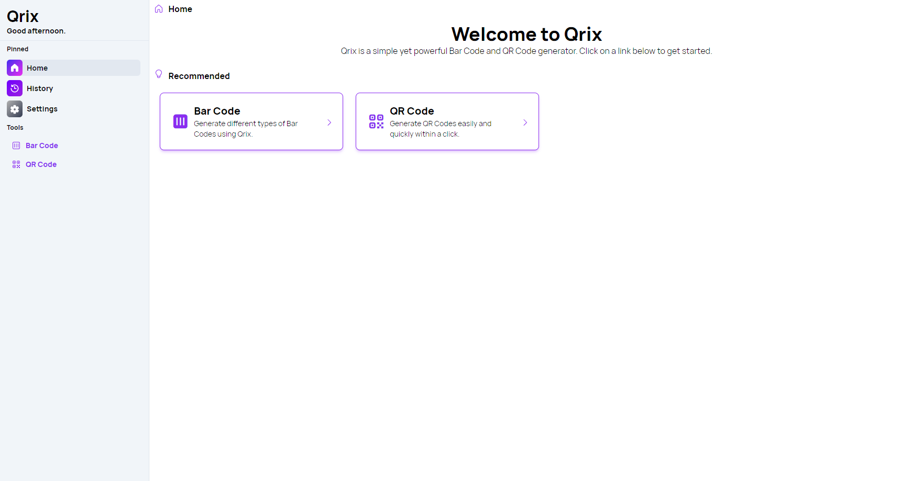

A new version of Qrix is now available, and it is the version 1.9.0.2407. We added the possibility to search history, to see directly the metadata of Interactive QR Codes and more.

## New features in History page

Qrix has elevated user experience with its latest update, introducing powerful new features for managing and viewing Interactive QR Codes. Users can now effortlessly search their Bar/QR Code history, streamlining the process of revisiting and managing past creations. This feature is particularly valuable for businesses and event organizers who need quick access to previously generated codes. Additionally, Qrix now offers direct visibility into the metadata of Interactive QR Codes, providing insights into embedded information such as URL destinations, contact details, or event specifics without the need for scanning.

## New navigation bar

We added a new navigation bar on desktop devices, making the app design clearer. This new navbar is similar to [Passliss' new navbar](/blog/content/post/passliss-version-4302407/) we introduced yesterday.

## Changelog

### New

- Disabled Create button if fields are empty in Bar code page (#461)
- Disable Create button if fields are empty in Bar code page (#461)
- Added metadata to Interactive QR Codes (#462)
- Added translations (#462)
- Added metadata viewer in History (#462)
- Added metadata mobile UI in History (#462)
- Added search feature in History (#463)
- Added new navbar design (#464)

### Fixed

- Fixed an issue when saving metadata (#462)
- Fixed key issue

### Updated

- Removed old background assets (#464)
- _Updated dependencies_

## Launch Qrix

[Click here](ttps://qrix.leocorporation.dev) to launch Qrix in your browser.

## Learn more

[Click here](https://leocorporation.dev/store/qrix) to learn more about Qrix.
