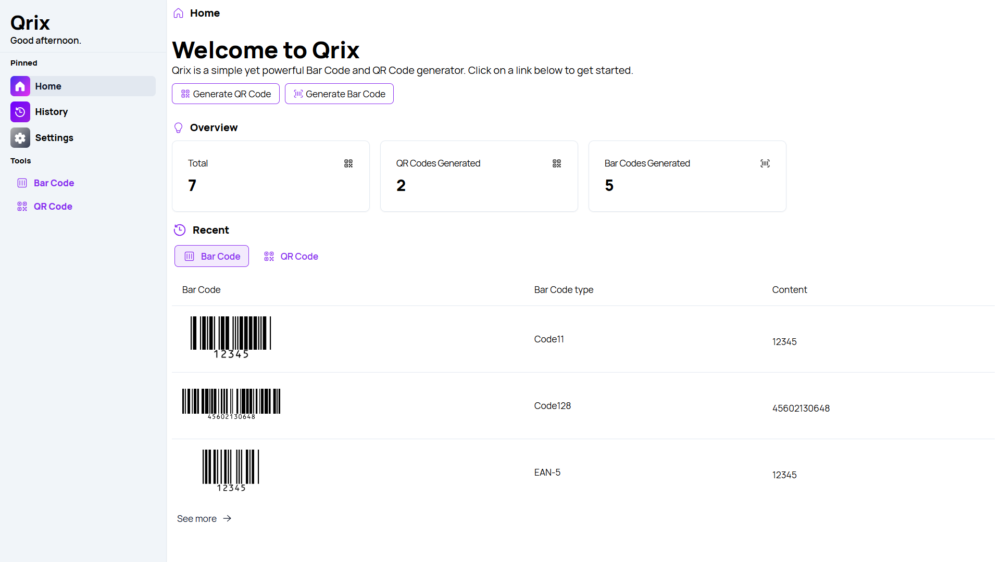
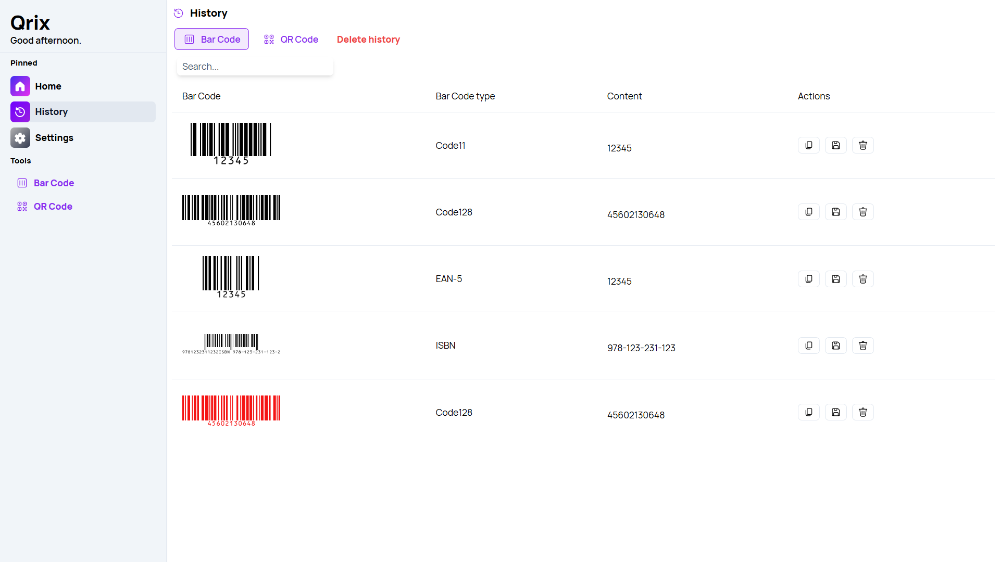
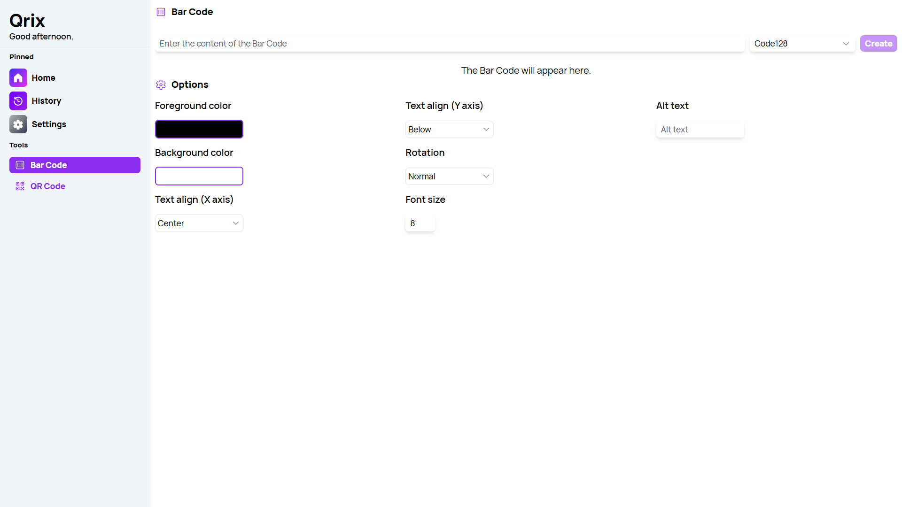

Welcome to the exciting world of Qrix v2, where creating and customizing bar codes and QR codes has become easier and more efficient than ever. With a focus on simplicity, speed, and user-friendliness, Qrix continues to evolve, meeting the diverse needs of its users. The latest update, Qrix v2, introduces several new features and enhancements that make this web app an indispensable tool for both personal and professional use.

## New features

### Revamped Home page

One of the standout features of Qrix v2 is the revamped Home Page dashboard. The new layout is designed to offer a seamless user experience, making it easier for users to navigate and access the functionalities they need. The dashboard's clean and intuitive interface is complemented by the addition of new locales, making the app accessible to a broader audience. Users can now enjoy a more personalized experience, choosing between light and dark themes, with a clear indication of the selected theme thanks to the newly added border feature in Settings.

### New History page

The History Page has also undergone a significant transformation. With a new user interface dedicated to both bar codes and QR codes, keeping track of your previous creations is now more straightforward. The updated design includes new placeholders, providing a more organized and user-friendly way to view and manage your code history. This feature is especially beneficial for users who frequently generate codes and need to reference past projects.

### New Options sections

The new Options sections in the Barcode and QR Code pages give users greater control over their code creation process. These sections provide advanced settings that enable more detailed customization, allowing you to tailor your codes to specific requirements. Coupled with the new font options, users have more creative freedom than ever before.

## Changelog

### New

- Added border to selected theme in Settings (#488)
- Added new font (#489)
- Added new Options section in Barcode page (#489)
- Added new Options section in QR Code page (#489)
- Added Table component (#490)
- Added locales
- Added new History UI for Bar Code (#490)
- Added new History UI for QR Code (#490)
- Added Card component (#491)
- Added Dashboard locales (#491)
- Added History UI for Home page (#491)
- Added new Home page (#491)
- Removed legacy Dashboard card
- Added new placeholders in History (#490)

### Updated

- Updated License dialog
- _Updated dependencies_

## Launch Qrix

[Click here](ttps://qrix.leocorporation.dev) to launch Qrix in your browser.

## Learn more

[Click here](https://leocorporation.dev/store/qrix) to learn more about Qrix.
