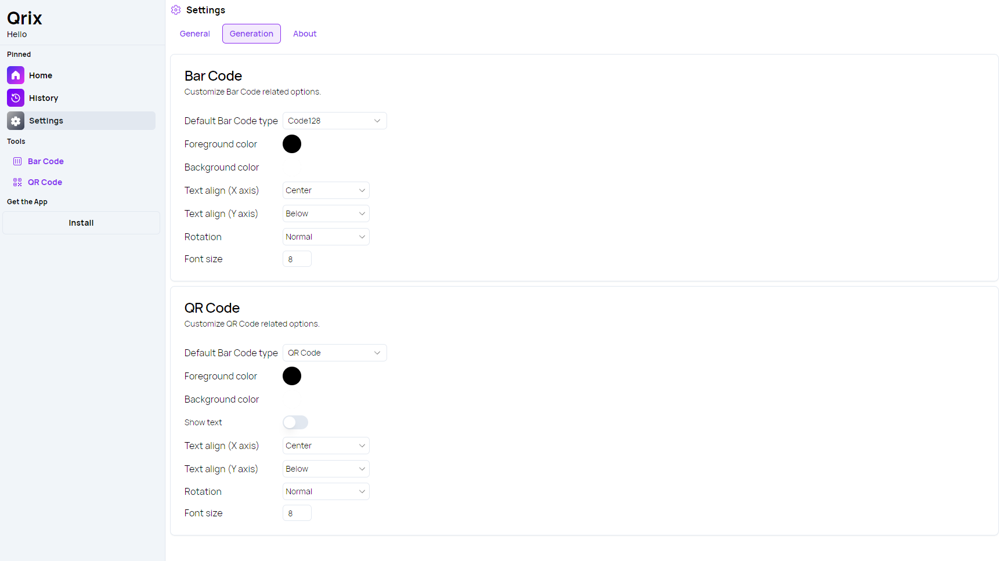

A new version of Qrix is now available and it brings a redesigned settings page.

## New Settings page

The Qrix app has undergone a significant redesign of its settings page, shifting from an accordion layout to a sleek tabbed UI design with informative cards. This new layout enhances usability by allowing users to access important settings with greater clarity and speed. The settings are now neatly divided into three sections: **General**, **Generation**, and **About**. In the **General** tab, users can customize the app's theme, language, and choose save options like PNG or JPEG formats. The **Generation** tab focuses on default settings for generating QR and barcodes, ensuring a smoother creation process. Finally, the **About** tab provides essential information, including licenses, a GitHub link, and version details. This streamlined approach makes it easier for users to find and adjust settings, improving the overall experience.

## Changelog

### New

- Added locales (#527)
- Added General Settings (#528)
- Added Generation Settings (#529)
- Added About Section (#530)

### Fixed

- Fixed alignment issue

### Updated

- _Updated dependencies_

## Launch Qrix

[Click here](ttps://qrix.leocorporation.dev) to launch Qrix in your browser.

## Learn more

[Click here](https://leocorporation.dev/store/qrix) to learn more about Qrix.
