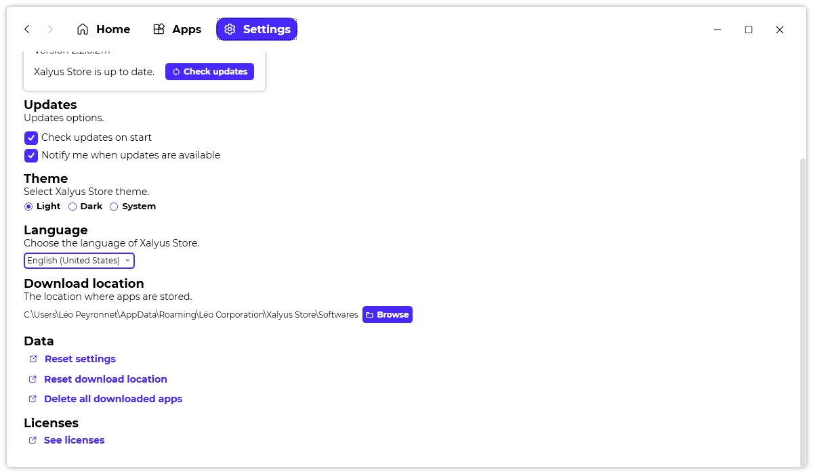

A new version of Xalyus Store is now available, and it is the version 2.2.0.2111.

## Changelog
### New
- Added Windows 11 in OSs list
### Fixed
- Fixed an issue where the maximize icon wasn't the right one
### Updated
- Updated dependencies
- Updated links design
- Changed "Required configuration" to "Minimal required configuration"
- Updated Splash Screen

## Download

[Click here](https://bit.ly/DownloadNewXalyusStore) to download Xalyus Store.

## Website

[Click here](https://leocorporation.dev/xalyus-store) to learn more about Xalyus Store.

## Screenshot
