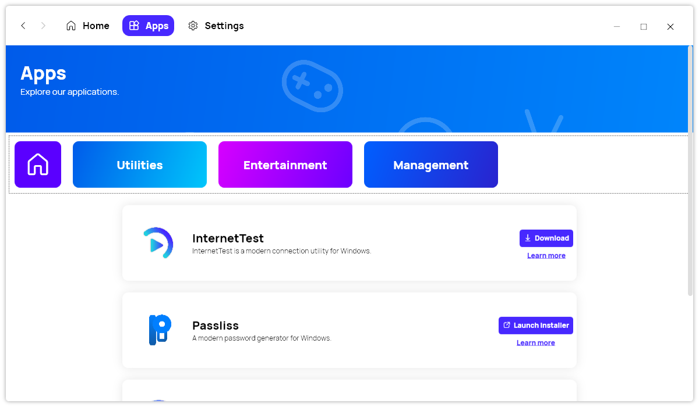

A new version of Xalyus Store is now available, and it is the version 2.3.0.2207.

## Changelog
### New
- Added font files
- Xalyus Store is now using C# 10 features

### Fixed
- Fixed alignment issues
- Updated default font
- Removed old font files

### Updated
- Updated to .NET 6
- Updated Splash Screen
- Updated Licenses

## Download

[Click here](https://bit.ly/DownloadNewXalyusStore) to download Xalyus Store.

## Website

[Click here](https://leocorporation.dev/xalyus-store) to learn more about Xalyus Store.

## Screenshot

